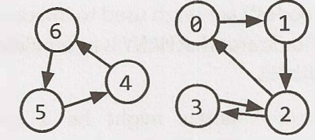
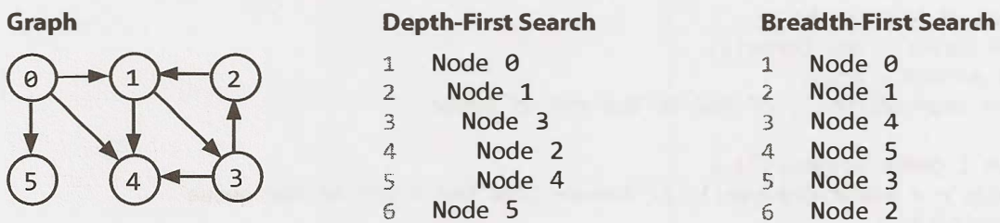
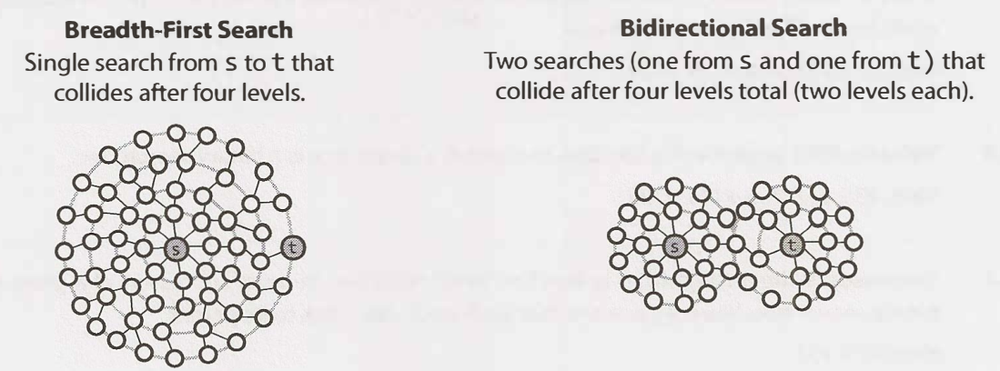

# Chapter 4: Trees and graphs

In trees, the worst case and average case time may vary wildly, and we must evaluate both aspects of any algorithm. A tree is a type of graph.

## 1. Trees

A tree is a data structure composed of nodes. Each tree has a root node, the root node has 0+ child nodes (0 or more). Each child node has 0+ child nodes, and so on. The tree can't contain cycles. The nodes might be in a particular order, they can have any data type as values, and may or may not have links back to their parent roles.

A simple class definition for Node is:

```java
class Node {
    public String name;
    public Node[] children;
}
```

We can also have a Tree class to wrap this node, but it's not usually used:

```java
class Tree {
    public Node root;
}
```

### 1.1. Trees vs. binary trees

A binary tree is a tree in which each node has up to 2 children. A node is called a 'leaf' node if it has no children.

### 1.2. Binary tree vs. binary search tree

A binary tree is a binary tree in which every node fits a specific ordering property: `all left descendents <= n < all right descendents`. This must be true for each node n. Regarding equality, under some definitions, the tree can't have duplicate values, in others, the duplicate values will be on the right or can be on either side. All are valid definitions but it must be cleared out with the interviewer.

This inequality must be true for all of a node's descendents, not just its immediate children. This is a binary search tree:

* 8
  * 4
    * 2
    * 6
  * 10
    * 20

This is not a binary search tree, because `12` is bigger than `10`:

* 8
  * 4
    * 2
    * 12
  * 10
    * 20

### 1.3. Balanced vs. unbalanced

Trees don't necessarily need to be balanced. Balanced means being balanced enough to ensure O(nlogn) times for `insert` and `find`, but not necessarily as balanced as it can be. Two common types of balanced trees are red-black trees and AVL trees (chapter 11: advanced topics).

### 1.4. Complete binary trees

A complete binary tree is a binary tree in which every level of the tree is fully filled, except for perhaps the last level. To the extent that the last level is filled, it's filled left to right. A complete binary tree:

* 10
  * 5
    * 3
    * 7
  * 20
    * 15

Not a complete binary tree, because `30` is bigger than `20`:

* 10
  * 5
    * 3
    * 7
  * 20
    * 30

### 1.5. Full binary trees

A full binary tree is a binary tree in which every node has either 0 or 2 children. There are no nodes with only one child.

### 1.6. Perfect binary trees

A perfect binary tree is one that is both full and complete, all leaf nodes are at the same level, and this level has teh maximum number of nodes. 2^k-1 nodes in total:

* 10
  * 5
    * 9
    * 18
  * 20
    * 3
    * 7

## 2. Binary tree transversal

### 2.1. In-order transversal

This means visiting/printing the left branch, then the current node, and then right branch

```java
void inOrderTransversal(TreeNode node) {
    if (node != null) {
        inOrderTransversal(node.left);
        visit(node);
        inOrderTransversal(node.right);
    }
}
```

### 2.2. Pre-order transversal

Visits the current node **before** its child nodes.

```java
void inOrderTransversal(TreeNode node) {
    if (node != null) {
        visit(node);
        inOrderTransversal(node.left);
        inOrderTransversal(node.right);
    }
}
```

### 2.3. Post-order transversal

Visits the current node **after** its child nodes. The root node is always the last node visited.

```java
void inOrderTransversal(TreeNode node) {
    if (node != null) {
        inOrderTransversal(node.left);
        inOrderTransversal(node.right);
        visit(node);
    }
}
```

## 3. Binary heaps (min-heaps and max-heaps)

Max-heap is just min-heap but with the elements in descending order rather than ascending.

A min-heap is a complete binary tree, totally filled other than the rightmost elements on the last level, where each node is smaller than its children. The root, therefore, is the minimum element in the tree.

* 4
  * 50
    * 55
    * 90
  * 7
    * 87

There are two key operations in min-heap, `insert` and `extract_min`.

### 3.1. Insert

We always start by inserting the element at the bottom. We insert at the rightmost spot so as to maintain the complete tree property. Then, we 'fix' the tree by swapping the new element with its parent, until we find an appropriate sport for it. We bubble up the minimum element. This takes O(logn), where n = number of nodes in the heap.


### 3.2. Extract minimum element

The minimum element at a min-heap is always at the top. Another matter is how to remove it. First, we remove the min element and swap it with the last element in the heap (the bottonmost, rightmost elem). Then, we bubble down this element, swapping it with one of its children until the min-heap property is restored.

Do we swap it with the left child or the right one? Depending on their values, there's no inherent ordering between the left and right elem, but we need to take the smaller one in order to maintain the min-heap ordering. This also takes O(logn) time.


## 4. Tries (prefix trees)

A trie is a variant of an n-ary tree in which characters are stored at each node, and each path down the tree might represent a word. The \* nodes, sometimes called 'null nodes', are often used to indicate complete words. If there's a \* node under 'MANY', it means that 'MANY' is a complete word.

The actual implementation of these * nodes can be a special type of child, like `TerminatingTrieNode`, which inherits from `TrieNode`, or a boolean flag `terminates` within the parent node.

A node in a trie can have anywhere from 1 through `alphabet_size + 1` children.


Commonly, a trie is used to store the entire (english) language for quick prefix lookups. While a hash table can quickly look up whether a string is a valid word, it can't tell if a string is a prefix of any valid words.

> A trie can check if a string is a valid prefix in O(k) time, where `k` is the length of the string, which is the same as the hash table lookup.

## 5. Graphs

A tree is a type of graph, but not all graphs are trees. A tree is a connected graph without cycles. A graph is simply a collection of nodes with edges between (some of) them.

* Graphs can be either directed (one-way) or undirected (two-way street)
* The graph can have multiple isolated subgraphs. If there's a path between every pair of vertices, it's called a 'connected graph'
* The graph can also have cycles. If it doesn't, it's called 'acyclic'



In programming, there are two common ways to represent a graph:

### 5.1. Adjacency list

Every vertex/node stores a list of adjacent vertices, in an undirected graph, an edge like (a,b) would be stored twice, once in `a`'s adjacent vertices and once in `b`'s adjacent vertices. A class definition could look the same as a tree node:

```java
class Graph {
    public Node[] nodes;
}

class Node {
    public String name;
    public Node[] children;
}
```

The class `Graph` is used because unlike in a tree, you can't necessarily reach all the nodes from a single node.

To represent the graph, an array or hash table of lists (arrays, arraylists, linked lists, etc) can store the adjacency list. The graph above:

```bash
0: 1
1: 2
2: 0, 3
3: 2
4: 6
5: 4
6: 5
```

### 5.2. Adjacency matrices

This is an NxN boolean matrix (N: number of nodes), where a `true` value at `matrix[i][j]` indicates an edge from the node `i` to the node `j`. In an undirected graph, the matrix is symmetric. In a directed one, it needn't be.

The same graph algorithms that are used on adjacency lists (breadh-first search, etc) can be performed with adjacency matrices, but might be somewhat less efficient.

* In the list representation, you can easily iterate through the neighbors of a node
* In the matrix representation, you need to iterate through all the nodes to identify a node's neighbors

## 6. Graph search

The two most common ways to search a graph are depth-first search and breadth-first search. In DFS, we start at the root (or another arbitrarily selected node) and explore each branch completely before moving on to the next branch. We go deep first.

In BFS, we start at the root (or another arbitrarily selected node) and explore each neighbor before going on to any of their children. We go wide.



DFS is better if we want to visit every node in the graph, and BFS better if we want to find the (shortest) path between two nodes.

### 6.1. Depth-first search (DFS)

We visit a node `a` and then iterate through each of `a`'s neighbors. When visiting a node `b` that's a neighbor of `a`, we visit all of `b`'s neighbors before going on to `a`'s other neighbors. `a` exhaustively searches `b`'s branch before any of its other neighbors.

We must check if a node has been visited, otherwise we might get stuck in an infinite loop.

```java
void search(Node root) {
    if (root == null) return;
    visit(root);
    root.visited = true;
    foreach (Node n in root.adjacent) {
        if (!n.visited) {
            search(n);
        }
    }
}
```

### 6.2. Breadh-first search (BFS)

There's a false assumption that BFS is recursive, it's not, it uses a queue. In BFS, node `a` visits each of `a`'s neighbors before visiting any of *their* neighbors. It's like searching level by level out from `a`.

```java
void search(Node root) {
    Queue queue = new Queue();
    root.marked = true;
    queue.enqueue(root); // add to end of queue

    while (!queue.isEmpty()) {
        Node r = queue.dequeue(); // remove from top of queue
        visit(r);
        foreach (Node n in r.adjacent) {
            if (!n.marked) {
                n.marked = true;
                queue.enqueue(n);
            }
        }
    }
}
```

### 6.3. Bidirectional search

This is used to find the shortest path between a source and a destination node. It runs two simultaneous BFS, one from each node. When their searches collide, the path is found.



Why is bidirectional search faster than BFS? Imagine that every node has <=`k` adjacent nodes and the shortest path from `s` to `t` has length `d`.

* In BFS, we would search <=`k` nodes in the first level of the search, then <=`k` nodes for each of those `k`, so `k`<sup>2</sup> nodes. We would do this `d` times, so O(k<sup>d</sup>)
* In bidirectional search, the two search collide at approximately d/2 levels, the midpoint. The search from `s` visits approximately k<sup>d/2</sup> nodes, same as the search from `t`. So so O(k<sup>d/2</sup>)
