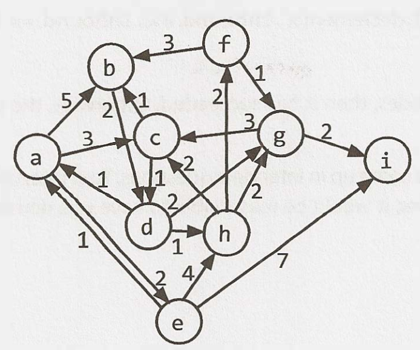
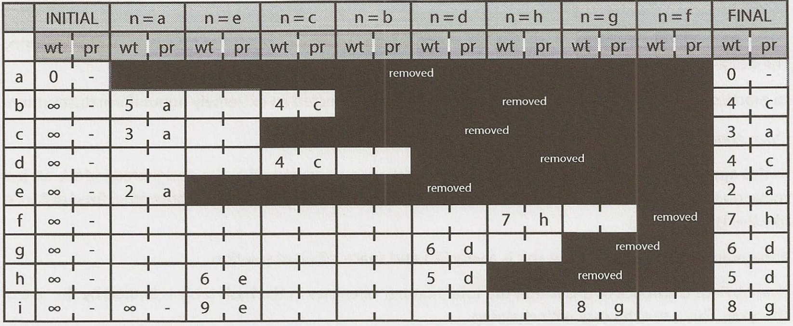
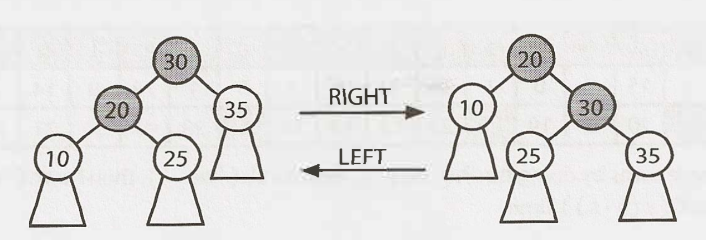
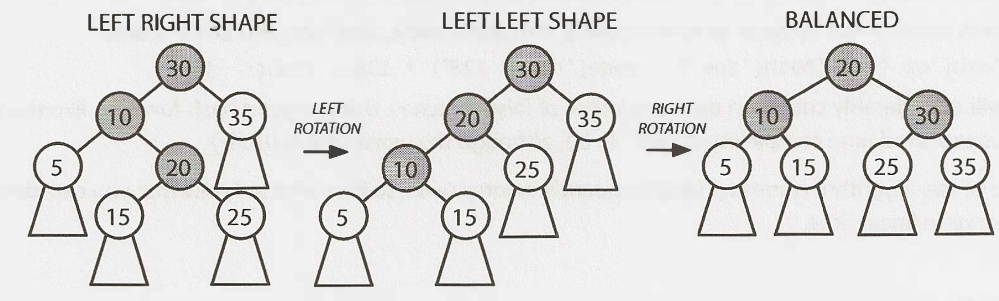
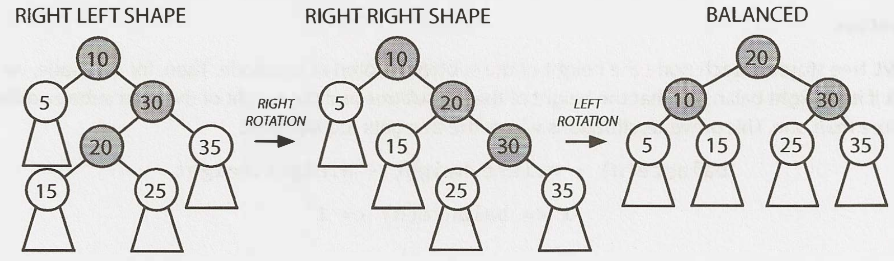

# Chapter 18 Advanced topics

> page 632 in book

## 18.2. Topological sort

This is a way of ordering the list of nodes such that if `(a, b)` is an edge in the graph, then `a` will appear before `b` in the list. If a graph has cycles or isn't directed, then there's no topological sort.

Applications: if a graph represents parts on an assembly line. The edge (Handle, Door) indicates that you need to assemble the handle before the door. The topological sort would offer a valid ordering for the assembly line.

1. Identify all nodes with no incoming edges and add those nodes to the topological sort
   1. Those nodes can be added first because they have nothing that needs to come before them
   2. Such a node must exist if there's no cycle. If we picked an arbitrary node, we could just walk edges backwards arbitrarily. We either stop at some point (in which case we've found a node with no incoming edges), or we return to a prior node (there's a cycle)
2. After that, remove each node's outbound edges from the graph
   1. Those nodes have already been added to the sort, so they're irrelevant. We can't violate those edges anymore
3. Repeat the above, adding nodes with no incoming edges and removing their outbound edges. We finish when all nodes are added to the sort.

More formally, the algorithm works like this:

1. Create a queue `order`, which eventually stores the valid topological sort. Empty at the beginning
2. Create a queue `processNext`, which stores the next nodes to process
3. Count the number of incoming edges of each nodes to set a class variable `node.inbound`. Nodes typically only store their outgoing edges. But we can count the inbound edges by walking through each node `n` and, for each of its outgoing edges (n, x), incrementing `x.inbound`.
4. Walk through the nodes again and add to `processNext` any node where `x.inbound` == 0
5. While `processNext` not empty:
   1. Remove first node `n` from `processNext`
   2. For each edge (n, x), decrement `x.inbound`. If `x.inbound` == 0, append `x` to `processNext`
   3. Append `n` to `order`
6. If `order` contains all the nodes, success. Otherwise, the topological sort has failed due to a cycle.

## 18.3. Dijkstra's algorithm

Dijkstra's algorithm finds the shortest path between two points in a weighted directed graph (which might have cycles). All edges must have positive values.

In some graphs we want edges with weights. If we have a graph of a city, each edge representing a road and its weight representing the travel time, what's the shortest path from your location `s` to another point `t`? The brute force option would be:

1. Start off at `s`
2. For each of `s`'s outbound edges, 'clone ourselves' and start walking. If the edge (s,x) has weight 5, it takes 5mins to go to `x`
3. Each time we arrive at a node, check if it has been visited before. if so, stop. Else, clone again and head out in all possible directions
4. The first one to get to `t` wins

Dijkstra's algorithm finds the minimum weight path from a start node `s` to **every** node in the graph.



We want to go from `a` to `i`. We first initialize some variables:

* `path_weight[node]`: maps from each node to the total weight of the shortest path. All values are initialized to infinity except `path_weight[a]` which is 0
* `previous[node]`: maps from each node to the previous node in the (current) shortest path
* `remaining` a priority queue of all nodes in the graph, where each node's priority is defined by its `path_weight`.

> A (min) priority queue is an abstract data type that supports insertion of an object and key, removing the object with the minimum key and decreasing a key. The difference with a typical queue, the difference is that instead of removing the oldest item, it removes the item with the lowest/highest priority. A priority queue can be implemented with an array or a min/max heap

Then we start adjusting the values of `path_weight`. We iterate through `remaining` until( it's empty, doing the following:

1. Select the node in `remaining` with the lowest value in `path_weight`. This node is `n`
2. For each adjacent node, compare `path_weight[x]` (which is the weight of the current shortest path from `a` to`x`) to `path_weight[n] + path_weight[(n,x)]`
3. Remove `n` from `remaining`

When `remaining` is empty, then `path_weight` stores the weight of the current shortest path from `a` to each node. We can reconstruct this path by tracing through `previous`.

Example:

1. n = `a`. Its adjacent nodes update the values of `path_weight` to 5, 3, 2 (b, c, e) and `previous` to `a`. Then remove `a` from `remaining`.
2. The next smallest node is `e`. `path_weight[e]` is already 2. Update `path_weight` to the accumullated weight + values of the adjacent nodes, 6, 9 (h, i) (2 + 4, 2 + 7) and `previous` for both of those.
3. The next smallest node is `c` with `path_weight`=3. Its adjacents are b, d. `path_weight[d]` has never been initialized (infinity), so it adopts the value of `path_weight[d] = path_weight[c] + path_weight[(c,d)]` = 3 + 1 = 4. `path_weight[b]` already had value=5, but since `path_weight[c] + path_weight[(c,b)]` = 3 + 1 = 4 is smaller, we update it. Also update `previous` to `c`.

Continue doing this until `remaining` is empty.



Once finished, we can start from the end node and get the `previous` node until reaching the beginning point. The path weight of going from `a` to `i` is 8.

### 18.3.1. Implementation

The runtime of this algorithm depends on the implementation of the priority queue. Assume we have `v` vertices and `e` edges

* If we use an array, then we call `remove_min` up to `v` times. Each operation takes O(v), so O(v<sup>2</sup>) only on `remove_min`. Also. `path_weight` and `previous` will be updated at least once per edge, so O(e) time. `e` must be <= v<sup>2</sup> because there can't be more edges than pairs of vertices. Therefore, runtime is O(v<sup>2</sup>).
* If we use a min heap, the `remove_min` calls take O(logv) (as will inserting/updating a key). We do one `remove_min` for each vertex, so O(vlogv). Also, on each edge, we might call one update key or insert operation, so O(elogv). Total runtime O((e+v)logv).

The best implementation depends on the number of edges. If the graph has a lot of edges, the array implementation O(v<sup>2</sup>) is better than O((v<sup>2</sup>+v)logv). But the graph is sparse, the min heap is better.

## 18.4. Hash table collision resolution

Collision in a hash table means there's already an item stored at the designated index.

### 18.4.1. Chaining with linked lists

The hash table's array maps to a linked list of items, items are just added to the linked list. As long as the number of collisions is fairly small, this is quite efficient. In the worst case, runtime is O(n), where n = \# elements in the hash table. This would only happen with strange data or a very poor hash function, or both.

### 18.4.2. Chaining with binary search trees

Rather than storing collisions in a linked list, store them in a binary search tree. The worst case runtime is then O(logn). This approach isn't used unless we expect a very nonuniform distribution.

### 18.4.3. Open addressing with linear probing

When a collision occurs, we move on to the next index in the array until we find an open spot, or sometime, some other fixed distance, such as idx + 5. If the \# collisions is low, this is very fast and space-efficient. A drawback is that the total \# entries in the hash table is limited by the size of the array, which isn't the case with chaining.

Another issue called *clustering*, a hash table with an underlying array of size 100, where only indexes 20-29 are filled. The odds of the next insertion going to index 30 is 10%, since any item mapped to 20-30 will end up at index = 30.

### 18.4.4. Quadratic probing and double hashing

The distance between probes doesn't have to be linear, it can be quadratic, or use another hash function to determine the probe distance.

## 18.5. Rabin-Karp substring search

Searching for a substring S in a bigger string B, brute force approach takes O(s(b-s)) time, by searching through the first b - s + 1 characters in B and for ech, checking if the next s characters match S.

If two strings are the same, they must have the same hash. But it's also possible for two different strings to have the same hash. If we efficiently precompute a hash value for each sequence of s characters within B, we can find the location of S in O(b) time. For example, hash function is sum of each character. The substring S has value of 24 for example. We go through the string B, check how many times the sum of characters is 24, and check which one (if any) are indeed equal to S.

How to compute the hash value? If we calculate hash value of each substring, that still takes O(s(b-s)). Instead, we know that hash(s[1:4]) = hash(s[:3]) - code(s[0]) + code(s[4]). This takes O(b) time.

## 18.6. AVL trees

An AVL tree is one of 2 common ways to implement tree balancing, here only insertions are discussed. An AVL tree stores in each node the height of the subtrees rooted at this node. Then, for any node, we can check if it's height balanced: that the height of the left subtree and the height of the right subtree differ by no more than one. This prevents situations where the tree gets too loopsided:

```math
balance(n) = n.left.height - n.right.height - 1
-1 <= balance(n) <= 1
```

### 18.6.1. Inserts

When inserting a node, the balance of some nodes might change to -2 or 2. When 'unwinding' the recursive stack, we check and fix the balance at each node. We do this through a series of rotations, which can be left or right rotations. The right rotation is the inverse of the left. Example:



Depending on the balance and where it occurs, we fix it differentlz

> Case 1: Balance=2

The left's height os 2 bigger than the right's height. The left subtree's extra node must be hanging to the left (like in LEFT LEFT SHAPE), or hanging to the right (as in LEFT RIGHT SHAPE). If it's like the left right shape, transform it with the rotations below into the left left shape, then into BALANCED. If it already looks like the left left shape, just transform it into BALANCED.



> Case 2: Balance=-2

This is the mirror image of the prior case.



In both cases, "balanced" means that the balance of the tree is between -1 and 1, not that it's 0. We recurse up the tree, fixing any imbalances. If we ever achieve a balance=0, we know there are no imbalances anymore. This portion of the tree won't cause another higher subtree to have a balance of -2/2. If we were doing this non-recursively, then we could break from the loop.
 